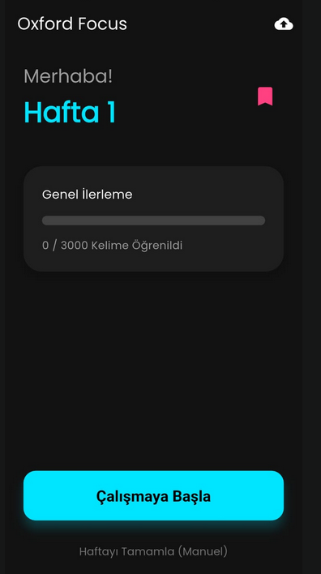
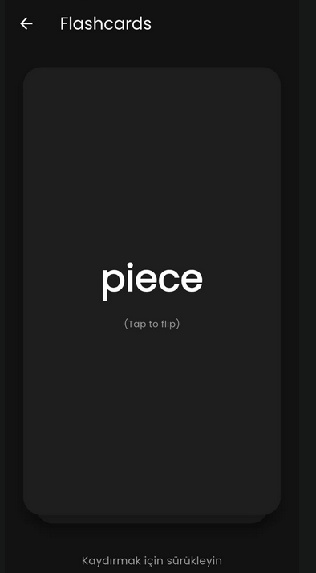
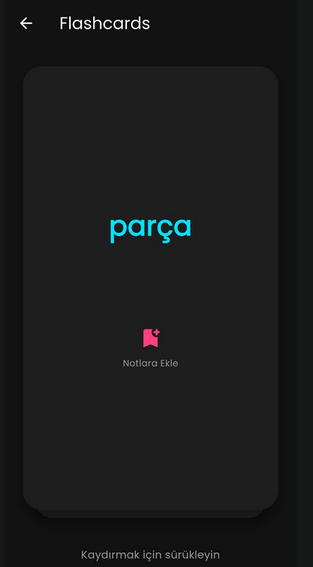

# Oxford Focus - İngilizce Kelime Öğrenme Uygulaması

Oxford Focus, Oxford 3000™ kelime listesini temel alarak geliştirilmiş, tamamen çevrimdışı (offline) çalışabilen, modern ve kullanıcı dostu bir flashcard uygulamasıdır.

<div align="center">
  
  
  
  
</div>

## 📱 Özellikler

*   **Çevrimdışı Çalışma:** İnternet bağlantısına ihtiyaç duymadan her yerde çalışabilirsiniz. Verileriniz cihazınızda güvenle saklanır (SQLite).
*   **Haftalık Öğrenme Döngüsü:** Her hafta size özel hazırlanmış 50 yeni kelime ve önceki haftalardan pekiştirmeniz gereken kelimelerle dinamik bir çalışma programı sunar.
*   **Akıllı Tekrar:** Öğrendiğiniz kelimeleri unutmamak için aralıklı tekrar sistemi.
*   **Oxford 3000™ Entegrasyonu:** En sık kullanılan 3000 İngilizce kelime ile sağlam bir temel oluşturun.
*   **Veri Yükleme (Seeding):** Hazır kelime paketini tek tıkla uygulamanıza yükleyin.
*   **Karanlık Mod:** Göz yormayan, şık ve modern arayüz tasarımı.

## 🛠 Kullanılan Teknolojiler

*   **Flutter:** Cross-platform mobil uygulama geliştirme framework'ü.
*   **SQLite (sqflite):** Güvenilir yerel veritabanı çözümü.
*   **Riverpod:** Güçlü ve esnek durum yönetimi (State Management).
*   **Freezed & JsonSerializable:** Kod üretimi (Code generation) ile tip güvenli veri modelleri.
*   **Flutter Local Notifications:** Günlük çalışma hatırlatıcıları.

## 🚀 Kurulum

1.  Projeyi klonlayın:
    ```bash
    git clone https://github.com/ahmetarabaci42/flashcard-mobile-app.git
    cd flashcard-mobile-app
    ```

2.  Bağımlılıkları yükleyin:
    ```bash
    flutter pub get
    ```

3.  Kod üretimini çalıştırın:
    ```bash
    dart run build_runner build --delete-conflicting-outputs
    ```

4.  Uygulamayı çalıştırın:
    ```bash
    flutter run
    ```

## 📦 Veritabanı Kurulumu (İlk Açılış)

Uygulamayı ilk kez yüklediğinizde kelime listesi boş gelecektir. Veritabanını doldurmak için:
1.  Ana ekrandaki sağ üst köşede bulunan **Bulut Simgesine** tıklayın.
2.  "Yükleme Tamamlandı" uyarısını gördüğünüzde kelimeleriniz hazır demektir.

## 🏗 Mimari

Proje, temiz mimari prensiplerine uygun olarak katmanlı bir yapıda geliştirilmiştir:
*   **Data Layer:** Repositories, Models, Local Data Source (SQLite), Seeding Service.
*   **Providers Layer:** Riverpod ile state yönetimi ve dependency injection.
*   **UI Layer:** Ekranlar, widget'lar ve temalar.
